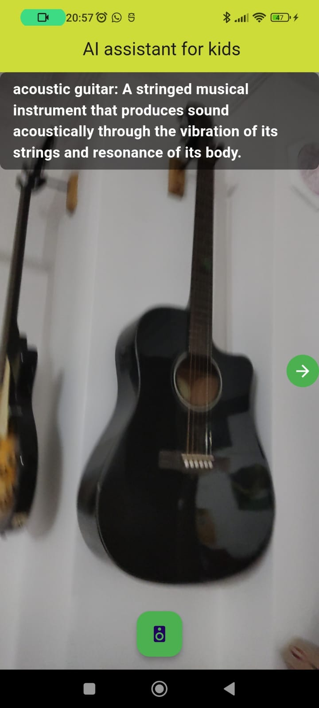
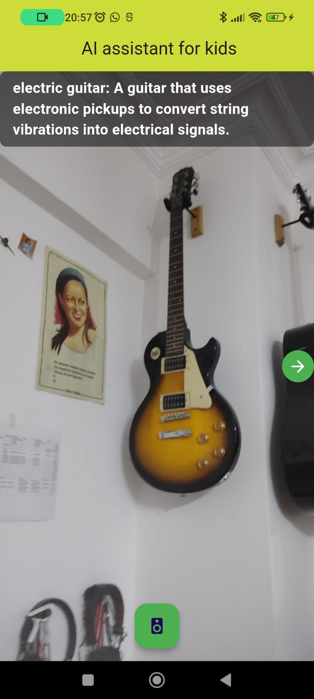
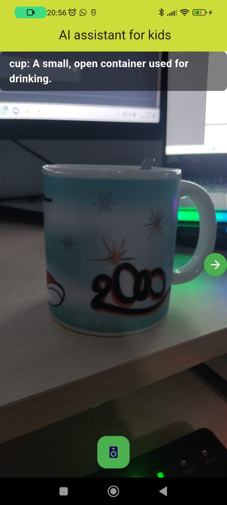
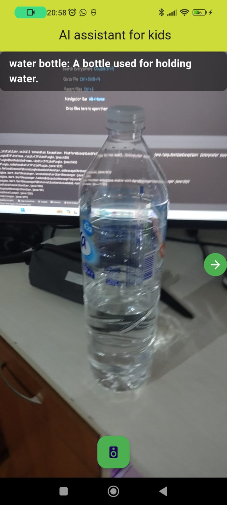
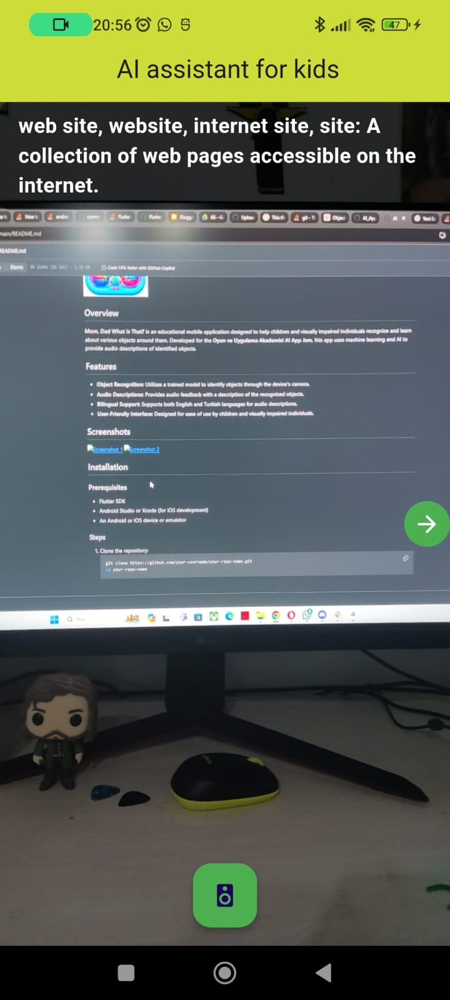

# Mom, Dad What Is That?

## Overview

**Mom, Dad What Is That?** is an educational mobile application designed to help children and visually impaired individuals recognize and learn about various objects around them. Developed for the **Oyun ve Uygulama Akademisi AI App Jam**, this app uses machine learning and AI to provide audio descriptions of identified objects.

## Features

- **Object Recognition**: Utilizes a trained model to identify objects through the device's camera.
- **Audio Descriptions**: Provides audio feedback with a description of the recognized objects.
- **Bilingual Support**: Supports both English and Turkish languages for audio descriptions.
- **User-Friendly Interface**: Designed for ease of use by children and visually impaired individuals.

## Screenshots

## Warnings and errors you may encounter
#  Despite these warnings on 19.05.2024, the application works properly, but since TF litle support has been withdrawn by Google, the long-term durability of such applications has a question mark.

 The plugin `tflite` uses a deprecated version of the Android embedding.
To avoid unexpected runtime failures, or future build failures, try to see if this plugin supports the Android V2 embedding. Otherwise, consider removing it since a future release of Flutter will remove these deprecated APIs.
If you are plugin author, take a look at the docs for migrating the plugin to the V2 embedding: https://flutter.dev/go/android-plugin-migration.
Launching lib\main.dart on M2102J20SG in debug mode...
Running Gradle task 'assembleDebug'...
C:\Users\tahay\AppData\Local\Pub\Cache\hosted\pub.dev\camera_android-0.9.8+3\android\src\main\java\io\flutter\plugins\camera\features\resolution\ResolutionFeature.java:154: warning: [deprecation] get(int,int) in CamcorderProfile has been deprecated
          return CamcorderProfile.get(cameraId, CamcorderProfile.QUALITY_HIGH);
                                 ^
C:\Users\tahay\AppData\Local\Pub\Cache\hosted\pub.dev\camera_android-0.9.8+3\android\src\main\java\io\flutter\plugins\camera\features\resolution\ResolutionFeature.java:158: warning: [deprecation] get(int,int) in CamcorderProfile has been deprecated
          return CamcorderProfile.get(cameraId, CamcorderProfile.QUALITY_2160P);
                                 ^
C:\Users\tahay\AppData\Local\Pub\Cache\hosted\pub.dev\camera_android-0.9.8+3\android\src\main\java\io\flutter\plugins\camera\features\resolution\ResolutionFeature.java:162: warning: [deprecation] get(int,int) in CamcorderProfile has been deprecated
          return CamcorderProfile.get(cameraId, CamcorderProfile.QUALITY_1080P);
                                 ^
C:\Users\tahay\AppData\Local\Pub\Cache\hosted\pub.dev\camera_android-0.9.8+3\android\src\main\java\io\flutter\plugins\camera\features\resolution\ResolutionFeature.java:166: warning: [deprecation] get(int,int) in CamcorderProfile has been deprecated
          return CamcorderProfile.get(cameraId, CamcorderProfile.QUALITY_720P);
                                 ^
C:\Users\tahay\AppData\Local\Pub\Cache\hosted\pub.dev\camera_android-0.9.8+3\android\src\main\java\io\flutter\plugins\camera\features\resolution\ResolutionFeature.java:170: warning: [deprecation] get(int,int) in CamcorderProfile has been deprecated
          return CamcorderProfile.get(cameraId, CamcorderProfile.QUALITY_480P);
                                 ^
C:\Users\tahay\AppData\Local\Pub\Cache\hosted\pub.dev\camera_android-0.9.8+3\android\src\main\java\io\flutter\plugins\camera\features\resolution\ResolutionFeature.java:174: warning: [deprecation] get(int,int) in CamcorderProfile has been deprecated
          return CamcorderProfile.get(cameraId, CamcorderProfile.QUALITY_QVGA);
                                 ^
C:\Users\tahay\AppData\Local\Pub\Cache\hosted\pub.dev\camera_android-0.9.8+3\android\src\main\java\io\flutter\plugins\camera\features\resolution\ResolutionFeature.java:178: warning: [deprecation] get(int,int) in CamcorderProfile has been deprecated
          return CamcorderProfile.get(cameraId, CamcorderProfile.QUALITY_LOW);
                                 ^
7 warnings
Note: C:\Users\tahay\AppData\Local\Pub\Cache\hosted\pub.dev\google_mlkit_commons-0.2.0\android\src\main\java\com\google_mlkit_commons\InputImageConverter.java uses unchecked or unsafe operations.
Note: Recompile with -Xlint:unchecked for details.
Note: C:\Users\tahay\AppData\Local\Pub\Cache\hosted\pub.dev\tflite-1.1.2\android\src\main\java\sq\flutter\tflite\TflitePlugin.java uses or overrides a deprecated API.
Note: Recompile with -Xlint:deprecation for details.
Note: C:\Users\tahay\AppData\Local\Pub\Cache\hosted\pub.dev\tflite-1.1.2\android\src\main\java\sq\flutter\tflite\TflitePlugin.java uses unchecked or unsafe operations.
Note: Recompile with -Xlint:unchecked for details.
Note: C:\Users\tahay\AppData\Local\Pub\Cache\hosted\pub.dev\tflite_flutter-0.9.0\android\src\main\java\com\tfliteflutter\tflite_flutter_plugin\TfliteFlutterPlugin.java uses or overrides a deprecated API.
Note: Recompile with -Xlint:deprecation for details.
√

## PUBSPEC

name: MDWT
description: Mom, dad what is that?
publish_to: 'none' # Remove this line if you wish to publish to pub.dev

version: 1.0.0+1

environment:
  sdk: '>=2.19.4 <3.0.0'

dependencies:
  flutter:
    sdk: flutter
  cupertino_icons: ^1.0.2
  get: ^4.6.5
  camera: ^0.9.8+1
  lottie: ^2.4.0
  image: ^3.2.0
  google_mlkit_image_labeling:
  tflite_flutter: ^0.9.0
  tflite: ^1.1.2
  flutter_tts: ^3.6.3

dev_dependencies:
  flutter_test:
    sdk: flutter
  flutter_lints: ^2.0.0

flutter:
  uses-material-design: true
  assets:
    - assets/

