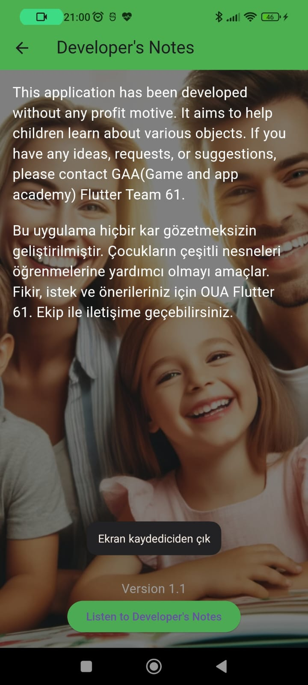

# Mom, Dad What Is That?

## Overview

**Mom, Dad What Is That?** is an educational mobile application designed to help children and visually impaired individuals recognize and learn about various objects around them. Developed for the **Oyun ve Uygulama Akademisi AI App Jam**, this app uses machine learning and AI to provide audio descriptions of identified objects.

## Features

- **Object Recognition**: Utilizes a trained model to identify objects through the device's camera.
- **Audio Descriptions**: Provides audio feedback with a description of the recognized objects.
- **Bilingual Support**: Supports both English and Turkish languages for audio descriptions.
- **User-Friendly Interface**: Designed for ease of use by children and visually impaired individuals.

## Screenshots

## PUBSPEC

name: MDWT
description: Mom, dad what is that?
publish_to: 'none' # Remove this line if you wish to publish to pub.dev

version: 1.0.0+1

environment:
  sdk: '>=2.19.4 <3.0.0'

dependencies:
  flutter:
    sdk: flutter
  cupertino_icons: ^1.0.2
  get: ^4.6.5
  camera: ^0.9.8+1
  lottie: ^2.4.0
  image: ^3.2.0
  google_mlkit_image_labeling:
  tflite_flutter: ^0.9.0
  tflite: ^1.1.2
  flutter_tts: ^3.6.3

dev_dependencies:
  flutter_test:
    sdk: flutter
  flutter_lints: ^2.0.0

flutter:
  uses-material-design: true
  assets:
    - assets/

